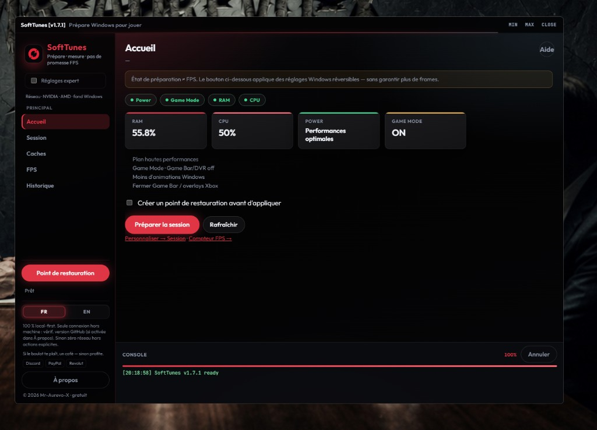

[Français](README.md) · [English](README.en.md)

# SoftTunes

Independent **Windows session prep + FPS meter**, **100% free** (**v2.0.0**, product name **SoftTunes**). Not a “+500 FPS booster”.



## Important

> **SoftTunes does not promise any FPS gain.** It is not a « +500 FPS booster ». It prepares Windows for a session (power plan, Game Mode, lighter desktop, overlays) and **meters** FPS via PresentMon. Frame rates depend on your game, hardware, and in-game settings.

| Does | Does not |
|------|----------|
| Perf power plan, Game Mode, desktop effects | Guarantee +XXX FPS |
| Close overlays (opt-in) | Replace GPU / serious undervolt |
| Meter FPS / frametime | Auto-download updates |
| Undo / sessions | Tune in-game graphics |

Publisher: Mr-Aurevo-X. SoftTunes is **not** part of the PC Command hub catalog.

> GitHub repo: **`Mr-Aurevo-X/SoftTunes`**. Latest: [v2.0.0](https://github.com/Mr-Aurevo-X/SoftTunes/releases/tag/v2.0.0). Binary: `SoftTunes.exe` / `Lancer.cmd`.

### v2.0.0

- **Void Glow** UI (confirms, update banner, chrome)
- Session / NVIDIA: honest live state (power, PL, Soft OC)
- SoftTunes About (legal, local paths, GitHub update opt-out)
- FPS HUD: color presets (Void Glow + neon)

- Prepares Windows for a play session (power plan, Game Mode, Xbox overlays, caches)
- Meters real FPS via **PresentMon** (HUD overlay) — does not promise extra frames
- NVIDIA-only clock locks (bounded, not undervolt)
- Local processing — no publisher collection
- Newer GitHub release: in-app notice + browser button (no auto-download)

Read-only public distribution: no PRs or issues (`CONTRIBUTING.md`). License: PolyForm Noncommercial 1.0.0.

## Where it installs

| Mode | Location |
|------|----------|
| **Installer** (`OptiSetup.exe` / setup) | `%LOCALAPPDATA%\Programs\SoftTunes` — binary + `_internal` |
| **Portable** (`SoftTunes.zip`) | Folder **of your choice**: extract the zip, keep `_internal` next to the exe |
| **Data** (sessions, undo, settings) | `%LOCALAPPDATA%\SoftTunes` |
| **Dev (sources)** | Clone under `03_Standalones\Opti\` + `Lancer.cmd` |

Legacy paths `%LOCALAPPDATA%\Programs\Opti`, `OptiBy-Mr-Aurevo-X`, `%LOCALAPPDATA%\Opti` are still detected on first launch (data migrates to SoftTunes if needed).

## Run

- Portable / install: run the exe from the install folder above
- Dev: `Lancer.cmd` at the clone root

## Build

```bat
tools\build_opti.bat
tools\build_setup.bat
```

## Support

Optional tips (SoftTunes stays free): Discord · PayPal · Revolut — see French README badges.

---

Dreamed by **Mr-Aurevo-X**. Cursor built the dream.
